# SatGate Demo Playbook

**The complete demo script for presenting Zero Trust access control and API monetization.**

This document provides commands, talk tracks, and objection handlers for demonstrating SatGate's full capability—from security (Crawl) to monetization (Run).

---

## Pre-Demo Checklist

- [ ] Terminal open with clean screen
- [ ] Railway deployment healthy (`curl https://satgate-production.up.railway.app/health`)
- [ ] Test delegation works: `node cli/delegation-demo.js` (local) OR `curl -X POST .../api/capability/demo/delegate` (server)
- [ ] Backup tokens pre-minted (in case of network issues)
- [ ] (Phase 3 only) Alby wallet funded with a few sats

> ✅ **Any-Device Ready:** All demo commands work via curl. No laptop required.

---

# 🔐 Phase 1: Stateless Access (Crawl)

**Goal:** Prove we solve IAM scale problems *today* without Bitcoin.

> This is **Crawl** in the maturity model: Zero Trust security via capability tokens. No quotas, no payments—just fast, stateless access control.

---

### **Scene 1: The "CISO" Persona (Token Minting)**

*Narrative:* "I am the CISO. I don't create a user. I issue a capability."

**Command:**
```bash
# Mint a master token for the "Data Agent"
curl -X POST https://satgate-production.up.railway.app/api/capability/mint
```

**Talk Track:**

> "See that? No database write. No service account. Just a token that says 'You can read data for 1 hour'. It's stateless."

---

### **Scene 2: The "Agent" Persona (Usage)**

*Narrative:* "The agent uses the token. Watch the speed."

**Command:**
```bash
# Use the token (Copy/Paste from previous step output)
curl -H "Authorization: Bearer <PASTE_TOKEN_HERE>" \
  https://satgate-production.up.railway.app/api/capability/ping
```

> 💡 **Pro-Tip: Smoother Demo Flow**
> Store the token in a variable to avoid copy-paste friction:
> ```bash
> # After minting, store the token:
> TOKEN=$(curl -s -X POST https://satgate-production.up.railway.app/api/capability/mint | jq -r '.token')
> 
> # Now use it cleanly:
> curl -H "Authorization: Bearer $TOKEN" https://satgate-production.up.railway.app/api/capability/ping
> ```

**Talk Track:**

> "Authenticated instantly. The Gateway validated the signature mathematically. No LDAP lookup. No bottleneck."

---

### Delegation Flow Diagram

```mermaid
sequenceDiagram
    participant CISO
    participant Agent
    participant Worker
    participant Gateway

    Note over CISO, Agent: Scene 1: Initial Issuance
    CISO->>Gateway: Request Master Token (Scope: read)
    Gateway-->>CISO: Issue Parent Token
    CISO->>Agent: Give Parent Token

    Note over Agent, Worker: Scene 3: The "Superpower" (Offline)
    Agent->>Agent: Cryptographically Attenuate Token
    Note right of Agent: ⚡ No Network Call<br/>Scope: read → /ping<br/>TTL: 1hr → 5min
    Agent->>Worker: Issue Child Token

    Note over Worker, Gateway: Scene 3b: Usage & Enforcement
    Worker->>Gateway: Request /ping (with Child Token)
    Gateway->>Gateway: Validate Signature & Constraints
    Gateway-->>Worker: 200 OK (Access Granted)
    
    Worker->>Gateway: Request /mint (with Child Token)
    Gateway->>Gateway: Scope Check Failed
    Gateway-->>Worker: 403 Forbidden (Scope Violation)
```



---

### **Scene 3: The "Superpower" (Offline Delegation)**

*Narrative:* "Now the Agent needs to delegate a task to a sub-worker. In the old world, this is a ticket. In our world, it's math."

**Command (Option A - Local):**
```bash
# Run the delegation simulation locally
node cli/delegation-demo.js
```

**Command (Option B - Server Backup):**
```bash
# If laptop unavailable, run from ANY terminal:
curl -X POST https://satgate-production.up.railway.app/api/capability/demo/delegate
```

> 💡 **"Two is one, one is none"** — Option B works from any device with curl (iPad, borrowed laptop, phone terminal app).

**Talk Track (Option A - Local):**

> "Watch the '[NETWORK]' line. Zero requests. The agent is minting a restricted credential offline. It just cut a spare key for the janitor that only opens the basement and expires in 5 minutes. This is the Google-grade capability competitors can't touch."

**Talk Track (Option B - Server Backup):**

> "I'm triggering this remotely to show you the logic. Even though this ran on my server just now for the demo, in production this entire logic happens inside the Agent's own code—client-side. That means zero latency and zero dependency on our uptime to create these sub-credentials. The agent doesn't phone home to delegate."

---

### **Scene 3b: The "Security Proof" (Least Privilege)**

*Narrative:* "But here's the key question: Can the child token escalate privileges? Let's test it."

> 💡 **Note:** Both Option A and Option B from Scene 3 output a CHILD TOKEN at the end. Copy that token for the tests below.

> 💡 **Pro-Tip: Store Child Token in Variable**
> ```bash
> # After running the delegation demo, store the child token:
> CHILD_TOKEN="<paste the child token here>"
> 
> # Now use it for both tests:
> curl -X POST -H "Authorization: Bearer $CHILD_TOKEN" .../api/capability/mint  # BLOCKED
> curl -H "Authorization: Bearer $CHILD_TOKEN" .../api/capability/ping          # ALLOWED
> ```

**Command 1: The BLOCKED Action (Negative Test)**
```bash
# Copy the CHILD token from Scene 3 output
# Try to mint a NEW token with it (should FAIL)
curl -X POST -H "Authorization: Bearer <PASTE_CHILD_TOKEN>" \
  https://satgate-production.up.railway.app/api/capability/mint
```

**Expected Output:**
```json
{
  "error": "Access Denied",
  "reason": "caveat check failed (scope = api:capability:ping): Scope violation: token has 'api:capability:ping', need 'api:capability:admin'",
  "hint": "Token scope does not permit this action"
}
```

**Talk Track:**

> "403 Forbidden. The child token tried to escalate privileges—to mint a new token. The Gateway rejected it. Not because we looked it up in a database, but because the **token itself** said 'I can only access /ping'. The math enforced least privilege."

---

### **Scene 3c: The "CISO Retains Authority" (Bonus Point)**

*Narrative:* "Even the tokens we mint are read-only by default. The CISO controls who gets admin power."

**Show the default token scope:**
```bash
# Mint a token (no special permissions)
curl -X POST https://satgate-production.up.railway.app/api/capability/mint
# Notice: scope = "api:capability:read" (read-only by default)

# Try to use it to mint another token
curl -X POST -H "Authorization: Bearer <TOKEN>" \
  https://satgate-production.up.railway.app/api/capability/mint
# Result: 403 - Scope violation
```

**Talk Track:**

> "Notice the default scope is 'read'. Even tokens minted by the system can't create more tokens. To get admin privileges, the CISO must explicitly grant them. No agent can escalate itself—the authority stays with the humans."

**Optional: Show explicit admin grant:**
```bash
# Only explicit admin scope can mint new tokens
curl -X POST -H "Content-Type: application/json" \
  -d '{"scope":"api:capability:admin"}' \
  https://satgate-production.up.railway.app/api/capability/mint
```

| Token Type | Default Scope | Can Mint? |
|------------|---------------|-----------|
| Regular mint | `api:capability:read` | ❌ No |
| Explicit admin | `api:capability:admin` | ✅ Yes |
| Delegated child | Inherited (restricted) | ❌ No |

---

**Command 2: The ALLOWED Action (Positive Test)**
```bash
# Same child token, but for its intended purpose
curl -H "Authorization: Bearer <PASTE_CHILD_TOKEN>" \
  https://satgate-production.up.railway.app/api/capability/ping
```

**Expected Output:**
```json
{
  "ok": true,
  "tier": "capability",
  "mode": "Phase 1: Capability-Only",
  "message": "✓ Authenticated with capability token..."
}
```

**Talk Track:**

> "200 OK. Same token, correct endpoint. The janitor's key opens the basement—nothing more, nothing less. This is Zero Trust at the token level."

---

### **Scene 4: The Crawl Close**

*Narrative:* "Everything you just saw happened without a single satoshi of Bitcoin."

**Closing Line:**

> "Crawl is live. Run (Payments) is just a config change away. And if you need Walk (Quotas) in between, same architecture—we just enable the governance layer."

---

# 💰 Phase 3: Economic Access (Run)

**Goal:** Prove that monetization is a config change, not a re-platform.

> This is **Run** in the maturity model: Pay-per-request access via L402. Same architecture as Crawl, plus proof-of-payment.

> 💡 **When to show this:** Only if the partner is interested in the monetization story. Phase 1 (Crawl) alone is often enough for security-focused clients.

---

### L402 Payment Flow Diagram


---

### **Scene 5: The Config Diff**

*Narrative:* "When you're ready to charge for this API, we don't deploy new code. We just update the policy."

**Show the conceptual config change:**

```yaml
services:
  - name: "my-service"
    # Crawl: Security Only (No payment)
    # price: 0
    
    # Run: Monetized (Uncomment to enable)
    price: 1  # sats per request
```

**Talk Track:**

> "One line. That's the difference between 'access control' and 'revenue generation'. Same Gateway. Same tokens. New capability."

---

### **Scene 6: The 402 Response (CLI)**

*Narrative:* "Let me show you what happens when payment is required."

**Command:**
```bash
# Hit the paid endpoint without payment
curl -i https://satgate-production.up.railway.app/api/micro/ping
```

**Expected Output:**
```
HTTP/1.1 402 Payment Required
WWW-Authenticate: L402 macaroon="...", invoice="lnbc..."
```

**Talk Track:**

> "402 Payment Required. This is a standard HTTP status code—not a proprietary hack. The response includes a Lightning invoice. The agent pays it instantly, gets a cryptographic token, and proceeds. No credit cards. No net-30 invoicing. No chargebacks."

---

### **Scene 7: The Payment Flow (Playground UI - Optional)**

*Narrative:* "Let me show you the full experience."

**Option A: Live Payment (if Alby wallet is funded)**
1. Open https://satgate.io/playground
2. Click "Request Protected Resource"
3. Pay the invoice via Alby
4. Watch the access granted

**Option B: Just Show the UI**
1. Open https://satgate.io/playground
2. Show the interface without paying
3. Explain: "The agent would pay this 1-sat invoice and immediately receive access."

**Talk Track:**

> "This is what an AI agent sees. Request, pay, access. Sub-second. Sub-cent. No accounts. No friction."

---

### **Scene 8: The Run Close**

**Closing Line:**

> "Crawl gives you security. Walk gives you governance. Run gives you revenue. Same architecture. Same day deployment. Different config file."

---

# 📚 Reference Materials

## Quick Recovery Commands

```bash
# Health check
curl https://satgate-production.up.railway.app/health

# Test L402 (Run) - should return 402
curl -i https://satgate-production.up.railway.app/api/micro/ping

# Test Capability (Crawl) - should return 401
curl https://satgate-production.up.railway.app/api/capability/ping

# Mint a fresh token
curl -X POST https://satgate-production.up.railway.app/api/capability/mint
```

---

## The "Maturity Model" Reference

### The Guardrails Framework

| Category | Phase | Question | Mechanism | Guardrail |
|----------|-------|----------|-----------|-----------|
| 🛡️ **Safety** | **Crawl** | "What are you allowed to do?" | Scopes & Attenuation | **Least Privilege** |
| 🛡️ **Safety** | **Walk** | "How much are you allowed to do?" | Rate Limits & Quotas | **Budget Control** |
| 🚀 **Growth** | **Run** | "How do we monetize this?" | L402 Payments | **Revenue Generation** |

### Demo Coverage

| Phase | Pitch Term | What You Showed | Crypto Required |
|-------|------------|-----------------|-----------------|
| **Phase 1** | **Crawl** | Scenes 1-4 (Capability tokens) | ❌ NO |
| **Phase 2** | **Walk** | Quota tracking (future) | ❌ NO |
| **Phase 3** | **Run** | Scenes 5-8 (L402 payments) | ✅ YES |

> 💡 **Note:** This demo covers **Crawl → Run**. Phase 2 (Walk) uses the same architecture but adds quota tracking—available when the client needs cost controls.

### The "Guardrails" Talk Track

> "Think of Crawl and Walk as establishing your **Guardrails**.
> 
> - **Crawl** locks down the *Permission* (so the agent can't hack you).
> - **Walk** locks down the *Volume* (so the agent can't bankrupt you).
> 
> Only once those two safety layers are proven do we look at **Run** to turn that traffic into revenue."

**Why this wins with CISOs:**
- Crawl stops the "Super-Admin Service Account" problem (every bot has root access)
- Walk prevents the "Runaway AI" nightmare (a loop costs $50k in API fees overnight)
- **CISO retains authority:** Tokens are read-only by default; admin scope requires explicit grant

---

## Objection Handlers

**"Is this just OAuth with extra steps?"**
> "OAuth tokens are opaque references to server-side state. These are self-describing, cryptographically verifiable capabilities. The token IS the permission—no database lookup required."

**"Why not just use JWTs?"**
> "JWTs can't be attenuated after issuance. With macaroons, an agent can mint a more restricted sub-token without calling us. That's the delegation superpower."

**"What about revocation?"**
> "Time-based expiry handles 90% of cases. For hard revocation, we maintain a small blocklist—but that's the exception, not the rule."

**"Why Lightning? Why not Stripe?"**
> "Stripe charges 2.9% + 30¢. That makes a 1-cent API call cost 31 cents. Lightning lets us charge 1 sat ($0.001) with near-zero fees. It's the only rail that makes micropayments viable."

**"Our clients won't use Bitcoin."**
> "That's exactly why we built Crawl and Walk. Start with the guardrails—no crypto required. When they're ready for monetization, the payment rail is already in place."

**"This seems risky for a conservative enterprise."**
> "We're not asking you to jump to payments. Crawl and Walk are the guardrails—permission control and budget control. We build the entire containment system before we ever turn on the fuel. Run is optional."

---

## Backup: Pre-Minted Tokens

```bash
# Generate backup tokens before the meeting:
curl -X POST https://satgate-production.up.railway.app/api/capability/mint > backup-token.json
```

